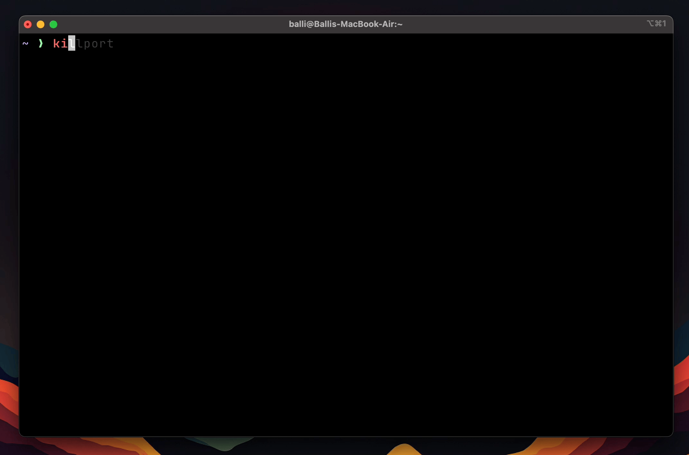

# Kill Port

### Kill Port is a simple command line tool to kill a process running on a specific port.



## Installation

```bash
sh -c "$(curl -fsSL https://raw.githubusercontent.com/BalliAsghar/killport/main/install.sh)"
```

### macos users can also install using brew

```bash
brew tap BalliAsghar/apps
brew install killport
```

## Usage

```bash
killport 3000
```

### Options

- `-f` or `--force` : Force kill the process
- `-u` or `--udp` : Kill the process running on UDP port

## License

[MIT](https://choosealicense.com/licenses/mit/)
