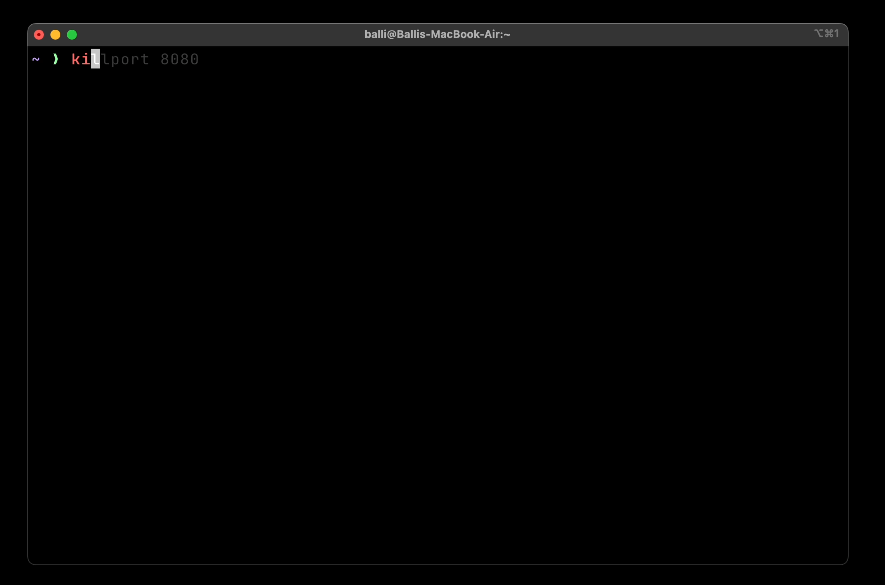

# Kill Port

### Kill Port is a simple command line tool to kill a process running on a specific port.



## Installation

```bash
sh -c "$(curl -fsSL https://raw.githubusercontent.com/BalliAsghar/killport/main/install.sh)"
```

## Usage

```bash
killport 3000
```
